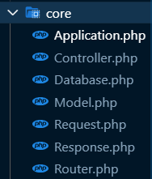

#



# application

-> khởi tạo đường dẩn route
-> tạo liên kết database
-> xử lý request

```php
    public static string $ROOTDIR; -> tạo đường dẩn toàn cục
    public static Application $app; ->  tạo 1 instance
    public Router $router; -> chức nặng tạo đường dẩn
    public Request $request; -> tiếp nhận request
    public Response $response; ->  change status code
    public Controller $controller;
    public Database $database;
```
