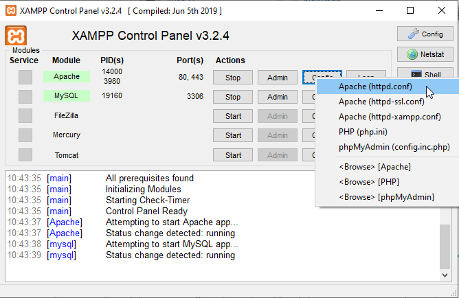
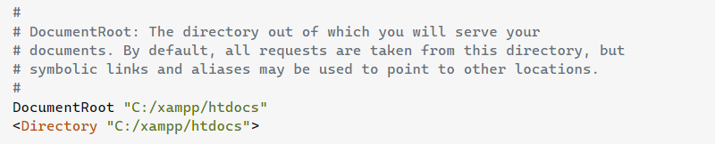

# config xampp

url: http://localhost

-   mở xampp
    
-   chọn config
-   thay đội dường dẩn root
    
    thành nơi chứa thư mục
    

# cấu trúc project

**assets** ->> chứa js,css,img
**confing** ->> thồng tin kết nối database(xampp mysql)
**controller** -> sủ lý yêu cấu và gọi tới model
**models** ->> tiếp nhận yêu cầu và gói tởi database
**view** ->> view
**Db_img** ->> tạo kho lưu img tại local
**public** -> thôn tin công khai
**utils** -> chứa function không phải là 1 lớp cụ thể mà chỉ phục vụ cho 1 tác vụ
**runtime** ->> ghị lại lôi trong quá trình chạy
**htaccess** ->> tạo đường dẩn default
